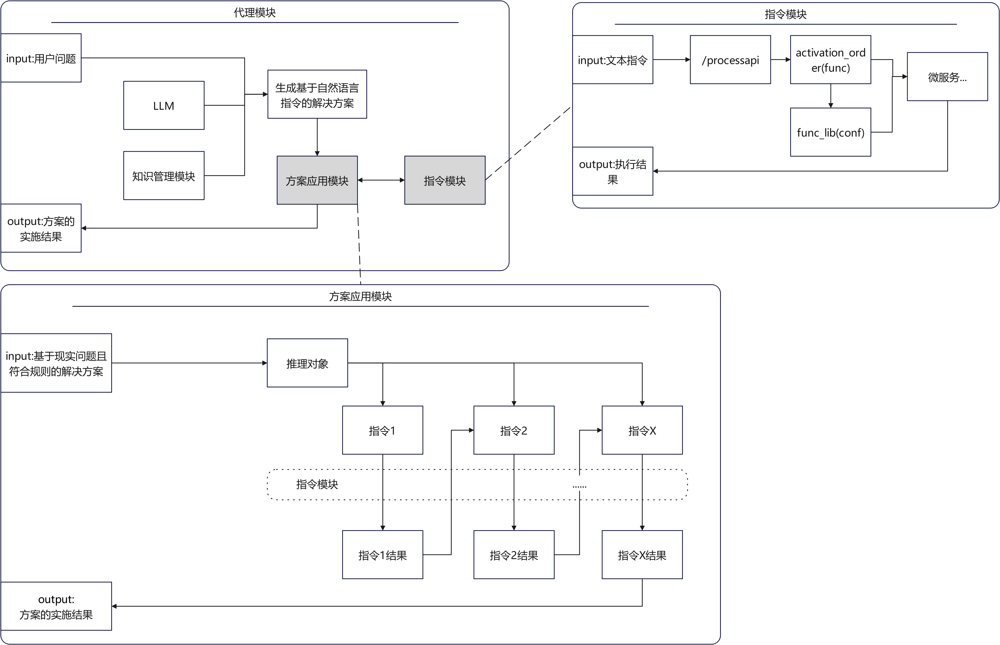
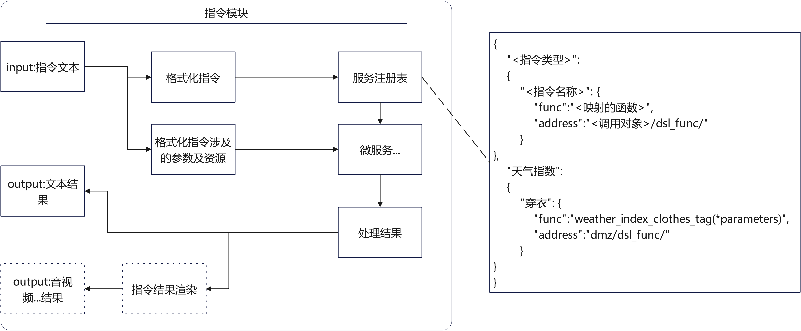
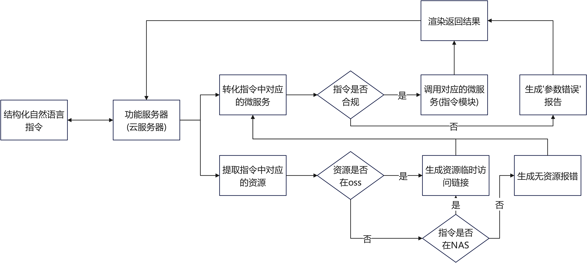

# 项目概述
<br>The project is sharing part of the design of a running agent-based application,
<br> which leverages LLMs for formal logical reasoning, 
<br>microservices for transforming reasoning results into data processing outcomes, 
<br>DDD and DSL for structuring and expressing domain knowledge, 
<br>and digital_twin technologies (ifc+gis+iot) 
<br>for realizing the physical manifestations of these data processing results.

<br>项目分享一个已经运行的智能体应用的部分设计.
<br>项目通过结合DDD+DSL进行LLM的'形式化逻辑推理';
<br>通过LLM+微服务完成'形式化逻辑推理'的'推理结果'到'数据处理结果'的转化;
<br>最后通过ifc+gis+iot完成'数据处理结果'到'物理现实的落地'.
<br>最终实现'AI以人类能理解的方式自主使用相关工具解决现实世界的问题'

----------
<br>当下咨询AI如何解决一个复杂问题时,基本上能得到一个相对合适的解决方案.
<br>但是我需要的不是解决方案,而是需要'它'直接帮我解决好.
<br>为了让自己和亲友有更多的时间来追逐自己想做的事情,
<br>我通过整合自身的资源和技能实现了AI生成解决方案的自动实施.
<br>自有服务运行了一段时间后,我决定把这个范式分享给大家
<br>希望大家也可以因此能节约出更多的时间做自己喜欢的事情.
## 模块构成
<br>项目主要由以下四个模块构成：
<br>1.代理模块：作为用户与系统的接口，负责接收用户输入的问题，并将其传递给后续模块进行处理。
<br>2.知识管理模块：存储和管理与问题相关的知识，包括领域知识、常识等，用于辅助LLM生成解决方案。
<br>3.方案应用模块：接收由LLM和知识管理模块生成的解决方案，并对其进行解析和逻辑抽取，然后分配执行次序。
<br>4.指令模块：根据方案应用模块提供的执行次序，调用相应的微服务完成子任务，并最终实现解决方案。
### 模块流程

<br>1.用户输入问题：用户通过代理模块输入问题。
<br>2.生成解决方案：LLM结合知识管理模块中的知识，生成基于问题和知识的解决方案。
<br>3.解析与逻辑抽取：方案应用模块接收解决方案，利用LLM和图数据库从中抽取逻辑，并分配执行次序。
<br>4.执行指令：指令模块根据执行次序，依次调用相应的微服务完成子任务。
<br>5.成果展示：通过WebGL等数据可视化技术，向用户展示解决方案的成果。

## 子模块概述
### 指令模块
<br>指令模块是通过结构化自然语言对微服务进行调用的一种方法,指令的输入输出均有自然语言的模态.
<br>指令模块通过post(/processapi)被调用,
<br>调用后通过指令处理函数将指令映射为请求参数,并提交到对应的服务执行.
<br>指令模块的返回除了支持文本形式的返回外,
<br>如需文本以外的数据返回,可以额外调用'渲染函数'向调用方提供更友好的数据渲染.
<br>同时指令模块中的指令既可以通过'方案应用模块'被llm调用也可以单独被服务集成

<br>当指令负载文件资源时,可以参考下图逻辑:

#### 指令示例
##### 空间类指令
<br>空间类指令用来解决数字孪生相关需求.
<br>通过指令中对现实空间位置的描述,实时创建孪生空间的场景实例.
<br>根据指令参数对场景实例或地理空间中的对象进行查询,模拟分析(碰撞检测,空间导航...)等操作
<br>进而获得对空间的分析结果,最终将结果做为其他指令的入参或通过图形渲染向用户渲染结果.
```
指令:场景推理;建筑计算,<空间名称>,<建筑计算子类型>,<建筑计算子参数>
	-用配置的建筑计算服务对<空间名称>对应的语义化数据按照<建筑计算子类型>,<建筑计算子参数>进行计算
指令:场景推理;建筑推理,<空间名称>,<建筑领域内要推理的问题>
	-用配置的建筑推理服务对<空间名称>对应的映射为建筑类语义化的数据结合'LLM+建筑推理prompt'进行推理
指令:场景推理;空间导航,<空间名称>,<预期到达的房间>,<预期出发的房间>
	-用配置的空间导航服务对<空间名称>对应的映射为空间类语义化的数据进行室内导航路径计算,并生成导航场景模拟
指令:地理空间;室外导航,<出发poi>,<到达poi>
	-用配置的室外导航服务根据<出发poi>及<到达poi>获取导航数据,并根据请求数据返回webgis或文本描述
指令:场景推理;空间推理,<空间名称>,<建筑领域内要推理的问题>
	-用配置的建筑推理服务对<空间名称>对应的映射为空间类语义化的数据结合'LLM+空间推理prompt'进行推理
```
其他指令[详见](https://github.com/weihai-limh/daytime_agent/blob/main/document/docs/instructions_list.md)

<br>以上示例为通过自然语言指令进行建筑推理,建筑计算及数据可视化

<br>以上示例为通过自然语言指令进行室内导航数据生成及数据可视化

<br>以上示例为通过自然语言指令进行室内导航数据生成及数据可视化

<br>我对于空间的理解主要分为室内和室外.空间数据的最低标准为其语义信息中具有经纬度信息.
<br>室内室外的空间转化通过uber的h3进行换算,当有可视化需求时室外通过webgis渲染,室内通过webgl渲染.
<br>室内数据主要为ifc为主的bim数据及openusd,室外数据主要为84的geojson
<br>室外空间对应的微服务建议封装为在线地图结服务合私有地图数据的形式.
<br>室外空间分析的逻辑为将数据同步为geojson后提交到后台通过QGIS进行分析
<br>室内空间的分析则根据问题的类型来判断,如果问题仅是模拟(碰撞检测,自动寻路,路径漫游...)可以通过图形引擎自身的物理能力进行模拟.
<br>如果问题包含空间的推理则可根据问题的复杂程度选择不同的处理模式.
<br>当出于'空间推理'模式时,会将当前场景中的所有实体对应的语义信息格式化为prompt经llm推理返回出结论.
<br>当出于'空间计算'模式时,会通过云服务进行对应的分析处理
<br>具体详见[数字孪生相关](https://github.com/weihai-limh/daytime_agent/blob/main/document/docs/digital_twin_correlation.md)
##### 资源类指令
<br>资源类指令主要解决在语境中获得供谓语处置的资源;
<br>例如:'我吃饭'中,'饭'即是被'吃'使用的资源(吃即为一个微服务)
<br>资源类指令通过部署的资源服务从NAS中获取提取对应资源
<br>在实践中可以在NAS到'资源服务'中增设一个'对象存储'
```
指令:基础应用;获取资源,<资源标签/资源实例>,<资源类型>
	-用配置的获取资源服务中根据<资源类型>根据<资源标签/资源实例>的值获取资源
```
其他指令[详见](https://github.com/weihai-limh/daytime_agent/blob/main/document/docs/instructions_list.md)

<br>其中包含了指令单独与HomeAssistant结合,所构建自己的智能家庭的应用
##### 数据处理类指令

<br>数据处理类指令通过封装资数据处理方向的微服务对文本中涉及的数据进行语义及模态的转化
<br>该类指令主要有三个方向,分别为:语义数据转化,影像数据处理,其他数据处理
<br>
<br>语义数据转化主要实现不同语义描述间的映射,
<br>例如同样由若干几何构件组成的场景后续若要在建筑运维语境下则将其转化为'bim';
<br>若要在数字孪生语境下应用则将其转化为'space';
```
指令:语义转化;建筑模型转建筑语义,<url>
	-用配置的建筑模型转建筑语义服务处理url指向的文件,将其转换为'可以被llm推理的建筑类语义'
指令:语义转化;建筑模型转空间语义,<url>
	-用配置的建筑模型转空间语义服务处理url指向的文件,将其转换为'可以被llm推理的空间类语义'
指令:语义转化;地理信息数据转geojson,<url>
	-用配置的地理信息数据转geojson服务处理url指向的文件,将其转换为'可以被llm推理的地理空间类语义'
```
其他指令[详见](https://github.com/weihai-limh/daytime_agent/blob/main/document/docs/instructions_list.md)
<br>影像数据处理主要处理音视频等影像资产,
<br>例如通过封装FFmpeg的微服务完成音视频的剪辑与提取;
<br>或者通过封装SAM和DepthPro的微服务完成图片中的对象提,追踪及点云重建;
<br>或者通过封装StableDiffusion的微服务将以上生成的素材重组为新的影像资产
```
指令:影像处理;遮罩生成,<图像或视频url>,<遮罩类型>,<处理参数>
	-用部署的遮罩服务根据遮罩类型和参数处理url指向的图像或视频
指令:影像处理;深度转换,<图像url>,<输出类型>
	-用部署的深度转换服务根据输出类型处理url指向的图像(png,gif)
指令:影像处理;点云转换,<图像url>,<输出类型>
	-用部署的点云转换服务根据输出类型处理url指向的模型(ply,splat)
指令:影像处理;局部重绘,<图像url>,<遮罩url>,<处理参数>
	-用部署的局部重绘根据遮罩url及参数处理url指向的图像
指令:影像处理;视频提取音频,<视频url>
	-用部署的视频提取音频服务处理url指向的图像
```
其他指令[详见](https://github.com/weihai-limh/daytime_agent/blob/main/document/docs/instructions_list.md)

<br>以上示例为通过自然语言指令调用图像处理指令完成对图像的处理
<br>其余数据处理归类于其他数据处理,并包含图表生成等基础数据可视化服务
```
指令:绘制图表;<图表类型>,<制表参数>
	-用配置的图表服务根据制表参数生成对应的图表
```

##### 在线服务集成指令
<br>在线服务集成指令通过将开放平台api的再次封装为微服务获得预期的数据

```

指令:基础ai;图像推理,图里有什么,<url>
	-用配置的多模态推理服务推理url指向的图片
指令:基础应用;语音合成,默认,<待合成的文本>
	-用配置的语音合成服务进行语音合成
指令:天气指数;天气查询,<时间>,<城市>
	-用配置的天气查询服务进行天气查询
指令:基础应用;语言转化,<待翻译的文本>,<转化类型>
	-用配置的翻译服务进行对应的翻译
指令:基础应用;发送邮件,<收件人>,<邮件标题>,<邮件内容>
	-用配置的邮件服务进行语音合成
```
其他指令[详见](https://github.com/weihai-limh/daytime_agent/blob/main/document/docs/instructions_list.md)<br>

<br>以上示例为通过自然语言指令调用在线api完成指令内涉及的文本推理及图像推理

<br>以上示例为通过自然语言指令完成语音识别及语音合成

<br>以上示例为通过自然语言指令完成指令内的天气查询及各类天气相关的标签

<br>以上示例为通过自然语言指令完成指令内的多语言翻译
### 方案应用模块
方案应用模块可对符合预期范式的文本段落进行推理.
推理分为线性推理和节点推理,线性推理通过正则获取文本中的逻辑,
节点推理通过antlr4+neo4j
#### 方案文本示例

<br>以上示例为线性推理示例
### 代理模块
#### 模块示例
##### 穿什么
## 关于项目
